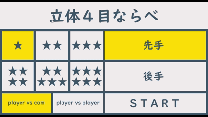
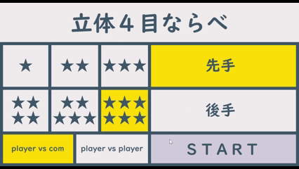
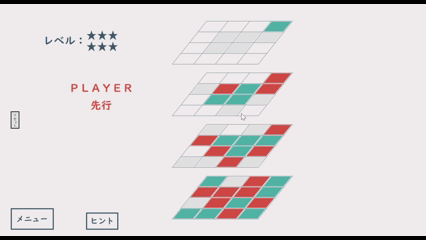

## はじめに
これは「立体４目並べ」ゲームのリポジトリです。

## コンセプト
思考ルーチンを学習するための枠組みとして「立体４目並べ」を制作する。

## 仕様
- 思考ルーチン（COM）を実装
- Mini-Max法、αβ法を用いて思考ルーチンを設計
- 最大探索局面数：１００万局面
- レベル星６の初期状態では自分の手から数えて６手先まで探索する

## ルール
- 平面、立体それぞれの縦、横、斜めのいずれかを自分の色でそろえると勝利

## デモGIF
- ホーム画面

  〇星が多いほど強くなります  
　星６以外は「ランダムで手を選ぶ」という条件を追加することで難易度を調整しています
  

- プレイ画面

- エンド画面

## 評価関数
〇絶対評価
  - ＣＯＭのビンゴが生じていた場合は評価を上げる
  - プレイヤーのビンゴが生じていた場合は評価を下げる
  - ＣＯＭのダブルリーチがあれば評価を上げる
  - プレイヤーのダブルリーチがあれば評価を下げる
  - プレイヤーに３段決勝点があって、ＣＯＭに ｘ座標とｙ座標 が同じの２段目決勝点がなければ評価を下げる
  - ＣＯＭに３段決勝点があって、プレイヤーに ｘ座標とｙ座標 が同じの２段目決勝点がなければ評価を上げる
  - ＣＯＭが後手の時、ＣＯＭの偶数段目決勝点を検出したら評価を上げる
  - 最善手の一つ上にプレイヤーの決勝点がある場合は評価を下げる

  『決勝点』  
    　そこを選択すればビンゴがそろうマスのこと

〇相対評価
  - 各マスに評価値を設定して全てを合計した値を用いる
  - マスごとの評価値はそのマスの有効ライン（ビンゴができる数）の合計値を用いる
  - 塗られたマスの都合で消滅した有効ラインの数を合計の評価値からマイナスする

## 実行ファイルの位置
x64/Release/connect4.exe

画像の読み込みがあるため実行ファイルを実行するときは Release ファイル内で実行してください。

## 使用技術
- 言語：C
- フレームワーク：Dxライブラリ
- IDE：Visual Studio 17.14.0

## おわりに
探索を深くするほど局面数が指数関数的に増加するため、Mini-Max法の限界を実感した。  
より強いCOMを実現するには、機械学習など別のアプローチを取り入れる必要があると感じた。  

製作期間：１カ月
