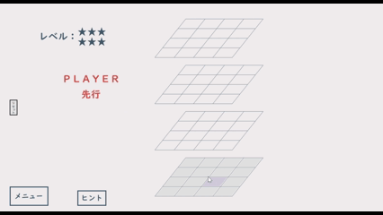

## はじめに
これは「立体４目並べ」ゲームのリポジトリです。

## コンセプト
思考ルーチンを学習するための枠組みとして「立体４目並べ」を制作する。

## 仕様
- 思考ルーチン（COM）を実装
- Mini-Max法、αβ法を用いて思考ルーチンを設計
- 最大探索局面数：１００万局面
- レベル星６の初期状態では自分の手から数えて６手先まで探索する

## ルール
- 平面、立体それぞれの縦、横、斜めのいずれかを自分の色でそろえると勝利

## デモGIF
- ホーム画面

  〇星が多いほど強くなります  
　星６以外は「ランダムで手を選ぶ」という条件を追加することで難易度を調整しています
  

- プレイ画面

- エンド画面

## 実行ファイルの位置
x64/Release/connect4.exe

画像の読み込みがあるため実行ファイルを実行するときは Release ファイル内で実行してください。

## 使用技術
- 言語：C
- フレームワーク：Dxライブラリ
- IDE：Visual Studio 17.14.0

## おわりに
探索を深くするほど局面数が指数関数的に増加するため、Mini-Max法の限界を実感した。  
より強いCOMを実現するには、機械学習など別のアプローチを取り入れる必要があると感じた。  

製作期間：１カ月
